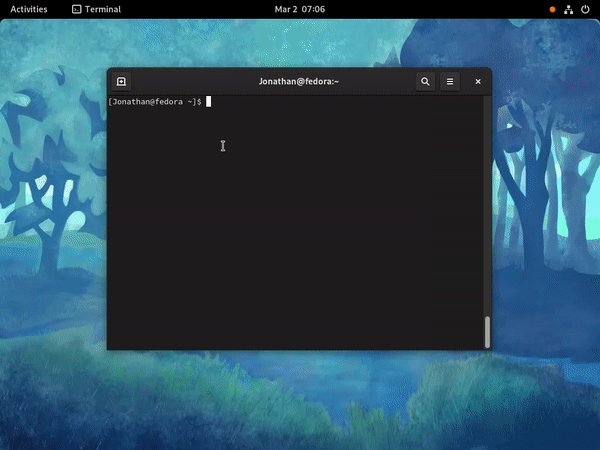

A search provider for GNOME Shell that adds support for searching in [pass](https://www.passwordstore.org/).

Names of passwords will show up in GNOME Shell searches, choosing one will copy the corresponding content to the clipboard.



# Installation
## Arch Linux
Install `gnome-pass-search-provider-git` from the AUR.

## Manual

Ensure that python>=3.5 and python-gobject are installed on your system and that pass is setup.

Download or clone this repository:
```shell
git clone git@github.com:jle64/gnome-shell-pass-search-provider.git
```

Run the installation script as root:
```shell
sudo ./install.sh
```

If you need to you can change the installation paths to suit your system:
```shell
sudo SYSCONFDIR=/etc DATADIR=/usr/share LIBDIR=/usr/lib LIBEXECDIR=/usr/lib ./install.sh
```

# Post-installation

Recommended : set gpg agent to use pinentry-gnome3 by adding `pinentry-program /usr/bin/pinentry-gnome3` to `~/.gnupg/gpg-agent.conf`.

If you are on Xorg, restart GNOME Shell by typing 'alt + f2' then entering 'r' as command.
If you are on Wayland, you need to close and reopen your GNOME session.

The search provider should show up and be enabled in GNOME search preferences and started on demand by GNOME Shell.

# OTP support

The [pass-otp](https://github.com/tadfisher/pass-otp) extension is supported. Searches starting with `otp` will copy the otp token to the clipboard.

# Environment variables

If you are configuring pass through environment variables, such as `PASSWORD_STORE_DIR`, make sure to set them in a way that will propagate to the search provider executable, not just in your shell.
Setting them in `~/.profile` should be sufficient.

# Clipboard managers

If you are using GPaste, passwords will be sent to it marked as passwords, thus ensuring they are not visible.
Otherwise they are sent to the clipboard using `pass -c` which defaults to expiration after 45 seconds.

# Compatibility

This implements the `org.gnome.Shell.SearchProvider2` D-Bus API which seems to be present in GNOME Shell since around 2012 and has been tested with GNOME Shell 3.22-3.30.

# Troubleshooting

If this does not work for you, make sure to look to wherever GNOME and D-Bus are logging for error messages (in the journal on systemd-using systems).
Don't hesitate to open an issue.
